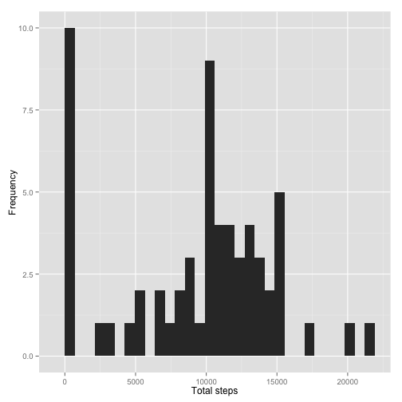

# Reproducible Research: Peer Assessment 1

---

## Loading and preprocessing the data

Read in the data.

```r
if (!file.exists("activity.csv")) {
    unzip("activity.zip")
}
activity <- read.csv("activity.csv")
```


Create a date.time column that combines the date and interval columns.

```r
time <- formatC(activity$interval/100, 2, format = "f")
activity$date.time <- as.POSIXct(paste(activity$date, time), format = "%Y-%m-%d %H.%M", 
    tz = "GMT")
```


For analyzing the means at the differnt times of day, it will also be convenient to have a time column. To do this, I convert all of the dates to be for today. since we only care about the time for that column, it will help us with the analysis.

```r
activity$time <- format(activity$date.time, format = "%H:%M:%S")
activity$time <- as.POSIXct(activity$time, format = "%H:%M:%S")
```


## What is mean total number of steps taken per day?

First, calculate the mean number of steps for each day:

```r
total.steps <- tapply(activity$steps, activity$date, sum, na.rm = TRUE)
```


Let's look at the mean and median for the total steps per day:

```r
mean(total.steps)
```

```
## [1] 9354
```

```r
median(total.steps)
```

```
## [1] 10395
```


And let's take a look at the distribution of total number of steps per day with a histogram:

```r
library(ggplot2)
qplot(total.steps, xlab = "Total steps", ylab = "Frequency")
```

```
## stat_bin: binwidth defaulted to range/30. Use 'binwidth = x' to adjust this.
```

 


## What is the average daily activity pattern?

Calculate the mean steps for each five minute interval, and then put it in a data frame.

```r
mean.steps <- tapply(activity$steps, activity$time, mean, na.rm = TRUE)
daily.pattern <- data.frame(time = as.POSIXct(names(mean.steps)), mean.steps = mean.steps)
```


Let's take a look at a time series plot for the mean steps.

```r
library(scales)
ggplot(daily.pattern, aes(time, mean.steps)) + geom_line() + xlab("Time of day") + 
    ylab("Mean number of steps") + scale_x_datetime(labels = date_format(format = "%H:%M"))
```

 


Which five minute interval has the highest mean number of steps?

```r
most <- which.max(daily.pattern$mean.steps)
format(daily.pattern[most, "time"], format = "%H:%M")
```

```
## [1] "08:35"
```


## Imputing missing values


## Are there differences in activity patterns between weekdays and weekends?
